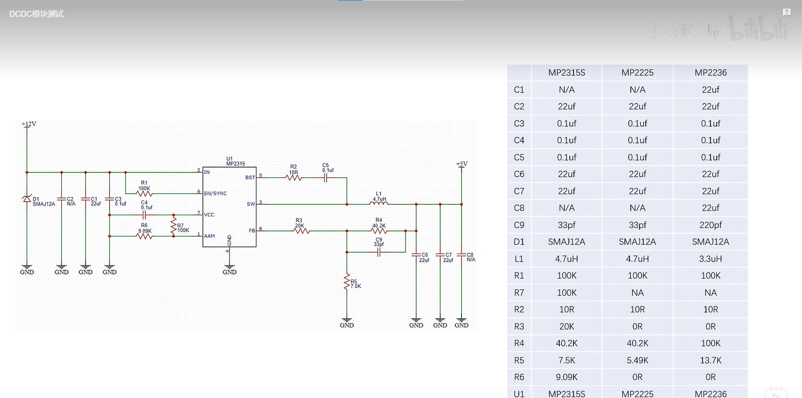
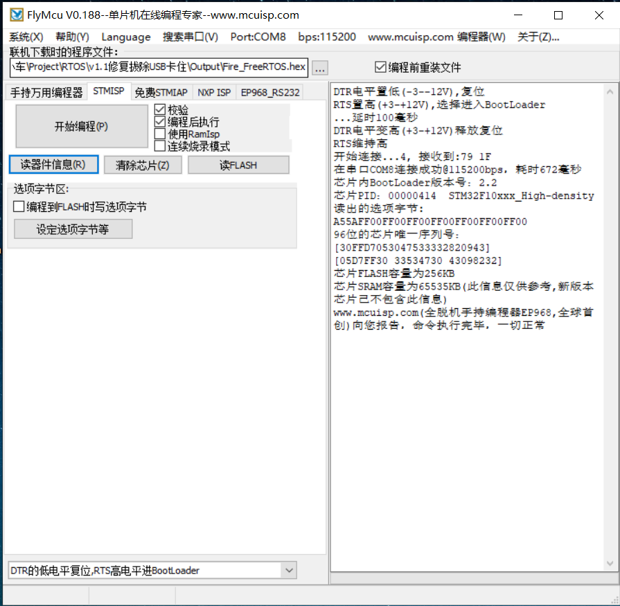

# STM32F103RCT6小车主控板

> 参考项目:[【自制】ROS机器人四电机驱动控制板_哔哩哔哩_bilibili](https://www.bilibili.com/video/BV1tR4y1w7xe/?spm_id_from=333.999.0.0&vd_source=1ef309ff3be99d9dd05b8566251abc3d)
>
> 开源链接：https://github.com/fan-ziqi/My_ROS_Robot

## 0.关于本项目

一款高集成度的小车主控板,这是基于开源项目修改而来的作品。将原本0402封装的部分阻容更换成0603更加便于焊接，制作成本大概在160~200元之间（部分元件价格波动较大导致）。

额外IO资源
| 引脚 | 特殊功能 | 引脚 | 特殊功能 |
| ---- | -------- | ---- | -------- |
| PA4  | ADC4     | PA12 | ---      |
| PA5  | ADC5     | PB12 | ---      |
| PA6  | ADC6     | PB13 | TIM1CH1  |
| PA7  | ADC7     | PC15 | ---      |
| PA8  | ---      | PC13 | ---      |
| PA11 | TIM1CH4  | PC14 | ---      |
| PB10 | TX3      | PB11 | RX3      |
| PC10 | TX4      | PC11 | RX4      |

## 1.硬件说明

### 焊接顺序

1. 开关电源 如果输出5V不正常就不用继续焊下去了(集成开关电源经常翻车,心态放好就行)。
2. 线性稳压电源 5转3.3这个一般不会翻车。
3. CP2102和typec口 焊接成功之后插入电脑可以找到CP2102的串口就表示成功。
4. STM32芯片 焊好之后可以通过USB一键下载。
5. MPU6050 如果无法读取数据的话检查是否虚焊(陀螺仪很容易虚焊,不要慌,趁现在器件还不是很多修补起来还是很容易的)。
6. TB6612和剩余器件。

如果你走完了上述步骤，则恭喜你获得一块小车主控板。

下面是我遇到的一些问题和解决办法：

1. 如果焊接完成以后发现单片机的速度比正常的慢了好几倍，可以检查一下晶振以及它旁边的两个电容有没有焊好。（内部RC振荡器的精度通常比用HSE（外部晶振）要差上十倍以上）
2. 接12V的时候注意看清楚正反，本人有幸冒过几次烟~

### 开关电源选择

常用的12转5开关电源有如下几款

| 型号    | 温度（3A） | 效率（3A） |
| ------- | ---------- | ---------- |
| MP2236  | 57.5℃      | 96%        |
| MP2225  | 82.2℃      | 94%        |
| MP2315S | 115℃       | 90%        |

BOM表差异

具体可以看工科男孙老师的测评

[如何让你的电源模块更强大 滤波电容越大越好嘛？_哔哩哔哩_bilibili](https://www.bilibili.com/video/BV1XQ4y1Q74n/?spm_id_from=333.788&vd_source=1ef309ff3be99d9dd05b8566251abc3d)

### 串口自动下载电路

## 2.软件说明

软件现在尚未完成,敬请期待

## 3.后话

小小吐槽一下原作者,把PC12,PD2这个串口5拿去点灯了，太奢侈了呜~

有什么问题欢迎留言讨论,共同进步!
